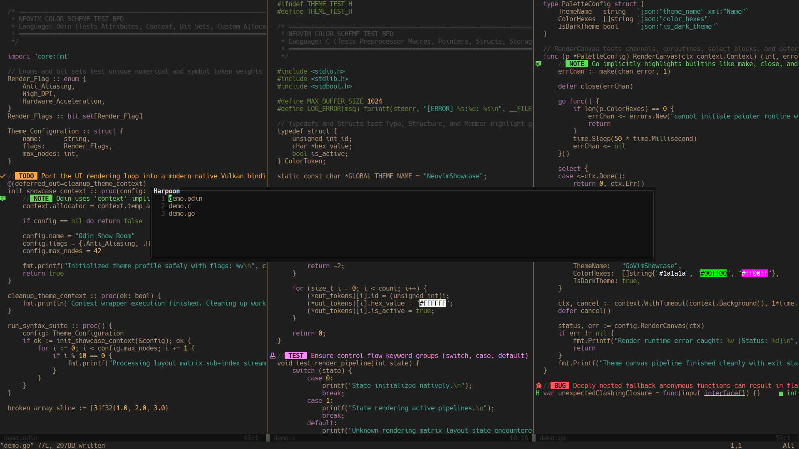

## Astigmatism Neovim

A dark Neovim color scheme for people with astigmatism.

Astigmatism can cause high contrast or high saturation text to appear to glow or blur even with glasses. This color scheme attempts to fix that.



#### Lualine


### Installation

Just add this to your lazy setup.

```lua
"nrawc/astigmatism.nvim"
```

Then add this to your init.lua to enable the colorscheme.

```lua
vim.cmd.colorscheme('astigmatism')
```

